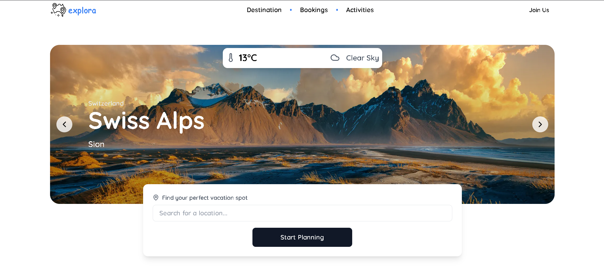

# *Explora*

  
*A preview of Explora's homepage.*

**Explora** is a travel planning website that provides curated itineraries, travel blogs, and detailed information on popular destinations and activities. Plan unforgettable trips with destination insights, recommended activities, and much more.

## Features

- **Curated and Custom Itineraries**: Choose from pre-built itineraries or create your own.
- **Travel Blogs**: Find inspiration and tips with articles on various travel topics.
- **Destination Insights**: Get in-depth information on popular destinations.
- **Activity Recommendations**: Discover activities tailored to each location.
- **Search Functionality**: Quickly search for destinations, blogs, and activities.

## Technologies Used

- **Next.js** - Server-rendered React framework for optimized performance.
- **TypeScript** - Typed superset of JavaScript for maintainable code.
- **MongoDB** - NoSQL database for flexible and scalable data management.

## Getting Started

Follow these steps to set up and run Explora on your local machine.

### Prerequisites

Make sure you have the following installed:

- **Node.js** (v14 or later)
- **npm** (for package management)
- **MongoDB** (or an external MongoDB connection string)

### Installation

1. **Clone the repository**:

   ```bash
   git clone https://github.com/yugalkaushik/explora.git
   cd explora

2. **Install Dependencies**
    ```bash
    npm install
3. **Set up environment variables**
   ```bash
    AUTH0_BASE_URL='http://localhost:3000'
    AUTH0_ISSUER_BASE_URL= (auth0 url)
    AUTH0_CLIENT_ID (Auth0 client id)
    AUTH0_CLIENT_SECRET (client secret key)
    MONGODB_URI (mongodb string)
4. **Run the development server**
    ```bash
    npm run dev
5. **Open http://localhost:3000 in your browser to view the application.**

### Contributing
Contributions are welcome! Please fork the repository, create a new branch, and submit a pull request.
